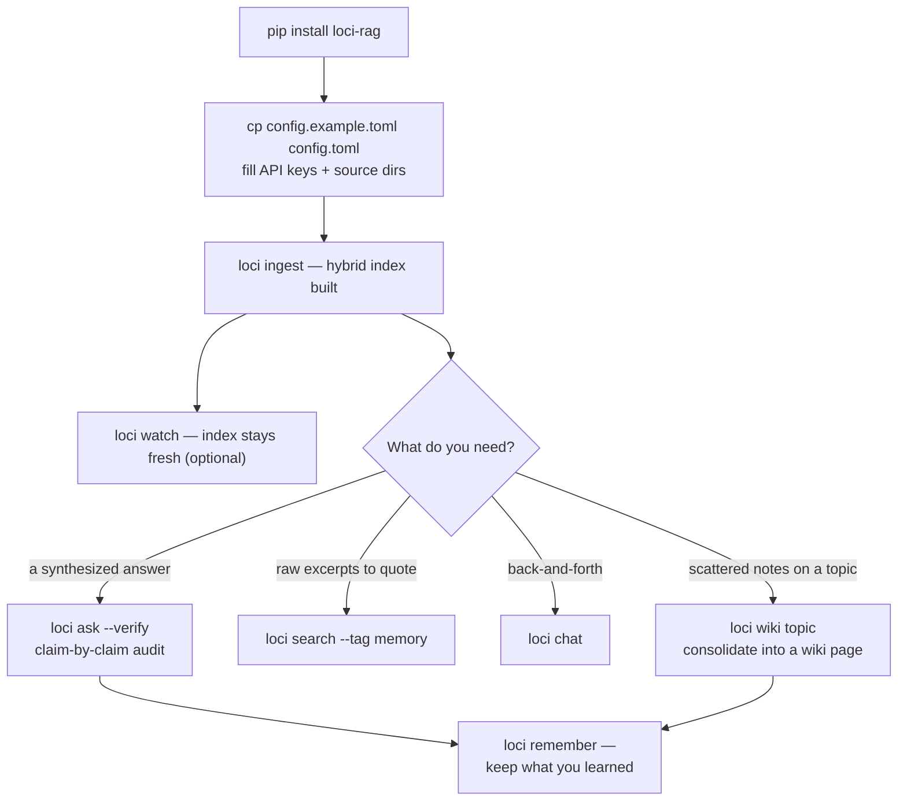

# loci 🧠

[](README.md)
[](README.zh-CN.md)
[](README.zh-TW.md)
[](README.ja.md)
[](README.ko.md)

> *この翻訳は英語版（canonical）より遅れる場合があります。*

[](https://github.com/IvenKooLab/loci/actions/workflows/ci.yml)
[](https://github.com/IvenKooLab/loci/blob/main/LICENSE)
[](https://github.com/IvenKooLab/loci)
[](https://glama.ai/mcp/servers/IvenKooLab/loci)
[](https://modelscope.cn/mcp/servers/IvenKooLab/loci)

> 2000 年前、弁論家はスピーチを宮殿の部屋に置き、その部屋を歩き回ることで思い出しました。**loci はあなたのファイルに対して同じことを行います。**
>
> *Loci* はすべての記憶宮殿の背景にある手法です。知識を場所に置き、パスを辿って思い出す。

**あちこちのディレクトリに散らばったプロジェクト資料・ノート・チャットログのために、質問可能な「セカンドブレイン」を。さらに MCP サーバー付きで、AI エージェントからも直接使えます。**

ローカルファイル → 見出し認識チャンキング → 埋め込み → ハイブリッド検索（ベクトル + BM25）→ 引用付き LLM 回答。インデックスは完全にローカルに保存され、外に出るのは埋め込み/チャット呼び出しのみ。任意の OpenAI 互換 API（Zhipu / DeepSeek / Kimi / OpenAI など）に対応。

> **中心的な考え方**（13 の高スターツールの調査に基づく——詳細は[競合分析](docs/research/competitive-landscape.md)参照）：チャットアプリをもう一つ作るのではなく、**すべてのチャットアプリがマウントできるメモリレイヤー**を作る。Claude Desktop、Cursor、Cline、その他の MCP ホストが、無料で loci の UI になります。

## デモ

[minimax-h3-turing](https://github.com/IvenKooLab/minimax-h3-turing) のドキュメントをインデックス化した実際のセッション（パスは表示用に短縮）：

```
$ python main.py search "what the 22G card can and cannot do" -k 3

[1] minimax-h3-turing/docs/en/01-hardware-limits.md > 01 · What a 2080Ti 22G Can and Cannot Do    (similarity 0.562)
[2] minimax-h3-turing/docs/en/02-w4a8-vs-w4a4.md > 02 · Quantization Measured > You Can Try Without 22G  (similarity 0.446)
[3] minimax-h3-turing/docs/en/01-hardware-limits.md > ... > 3. VRAM is just barely enough — manage it  (similarity 0.504)

$ python main.py ask "How should I choose between T8 aggressive mode and the final-render mode, and why?"

Answer:
* Drafts / preview / shot selection: use T8 aggressive mode — a 43% speedup
  (2.7 min/clip), and "a different picture of equal quality" is fine for picking shots.
* Final shots: use final-render mode (no T8). T8 makes the numerical trajectory
  fork, so re-running with the same seed produces a different clip — which breaks
  the reproducibility final outputs need.

[source: docs/en/08-t8-blockcache-4step.md > Practical Advice (4-step Turbo route)]
[source: docs/en/06-faq.md > 12. Cache-style accelerators break "same-seed re-runs"]
```

ハイブリッド検索により、中国語のクエリでも英語ドキュメントがヒットします（その逆も同様）。キーワード証拠（BM25）がベクトル検索の盲点を補い、すべての引用はファイルだけでなく**セクション**を指します。

### ハイブリッド検索は本当に有効か（バイリンガル 10 クエリで測定）

```
$ python scripts/eval_retrieval.py scripts/eval_cases.example.jsonl
vector-only: 9/10  →  hybrid: 10/10
```

## リランキング：2 つのプロバイダ

`--rerank` で融合後の候補を再排序します：

| プロバイダ | 方式 | コスト |
|---|---|---|
| `llm`（デフォルト） | チャットモデルによる 0〜3 点の逐次スコアリング | LLM 呼び出し 1 回 |
| `local` | クロスエンコーダ、`pip install 'loci-rag[rerank]'` が必要 | GPU で 5 ペア約 30〜70ms — オフライン・無料 |

## Obsidian / ノートアプリとの関係

競合しません — レイヤー分けです。Obsidian（または任意のエディタ）がノートのフロントエンド、loci は**クロスボールト検索エンジン**です。`sources` を任意のディレクトリ（Obsidian ボールト、プロジェクト資料、チャットエクスポート）に向ければ、ターミナル・スクリプト・MCP 経由の AI エージェントから一括検索できます。Obsidian ネイティブの詳細も理解します：frontmatter `tags:`（`--tag` でフィルタ）、`[[ウィキリンク]]` グラフ（`links` コマンド）、コードブロックは決して分割されず、1 行ノートも検索可能。

## インストールとクイックスタート

Python 3.11+ が必要（標準ライブラリ `tomllib` を使用）。

```bash
# 方法 A：パッケージとしてインストール（`loci` と `loci-mcp` コマンドが追加されます）
pip install -e ".[pdf,docx]"   # オプション extras：表込み PDF、Word 文書

# 方法 B：インストールなしでクイックスタート
pip install -r requirements.txt

# 1. 設定：サンプルをコピーして値を記入
cp config.example.toml config.toml

# 2. 取り込み（増分 — コンテンツハッシュで重複排除、再実行安全）
loci ingest            # または: python main.py ingest

# 3. 質問する
loci ask "what did I write about X?"
```

### ワークフロー



## コマンド

| コマンド | 機能 |
|---|---|
| `ingest` | ソースディレクトリをスキャンし、新增/変更ファイルをインデックス、削除済みを整理（`--force` で全件再構築） |
| `search "query"` | 検索のみ — `パス > セクション` パンくず付きのランキング結果 |
| `ask "question"` | 検索 + 引用付き LLM 回答 |
| `ask "…" --verify` | 主張ごとの監査を追加（✓ 支持 / ~ 部分 / ✗ 未支持） |
| `links "note"` | ノートの `[[ウィキリンク]]` グラフを表示 |
| `chat` | マルチターン Q&A ループ（`/clear`、`/exit`） |
| `wiki topic` | インデックス内のトピックに関する内容を wiki ページに蒸留 |
| `remember text` | 永続メモを書き込み、即座にインデックス |
| `stats` | インデックス概要：ソースごとのチャンク数、モデル、検索設定 |
| `doctor` | ヘルスチェック：設定、ソースディレクトリ、embed/LLM エンドポイント、ストア |
| `watch` | ソースをポーリングしてインデックスを最新に保つ（オプション） |
| `python mcp_server.py` | MCP サーバー（stdio、下記参照） |

フィルタオペレータ（`search` と `ask` で自由に組み合わせ可能）：

| パラメータ | フィルタ対象 |
|---|---|
| `--tag foo` | frontmatter タグに `foo` を含むファイル |
| `--in docs/en` | パスに該当部分文字列を含むファイル |
| `--since 2026-08` / `--since 2026-08-15` | 指定日以降に変更されたファイル |
| `-e "exact phrase"` | 完全一致フレーズを含むチャンク |
| `-k N` | ヒット数（デフォルト 5） |

## ひとつのメモリ、すべての IDE

すべての MCP ホストがマウントするのは**同じ** loci サーバー（同じ `config.toml`、同じインデックス）です。あるツールで書いたメモリは、他のすべてのツールから呼び出せます：

```bash
# Claude Code
claude mcp add loci -- loci-mcp
```

```jsonc
// Cursor / Cline / Qoder / Trae（mcpServers JSON — どこでも同じ形）
{ "mcpServers": { "loci": { "command": "loci-mcp" } } }
```

その後、どれかで：*「staging パスワードは月曜にローテーション」と記憶して* → `brain_remember` → 後日**別の** IDE で：*「staging パスワードはいつローテーション？」* → 引用付きで回答。メモリは `memories` ディレクトリ内のプレーン markdown（git フレンドリー、ロックインなし）として保存され、`memory` タグが付くため `loci search --tag memory` でメモリだけを検索できます。

> **クロス IDE のヒント**：デフォルトの `store` / `memories` パスは loci の起動ディレクトリ相対です。IDE ごとに異なるプロジェクトフォルダで起動する場合は、`config.toml` で両方を絶対パスに向けてください — 例：`store.path = "~/.loci/store"`、`memories.path = "~/.loci/memories"` — すべての IDE が同一のメモリストアを共有します。

## 任意の MCP ホストにマウント

`claude_desktop_config.json`（Claude Desktop）または使用中の MCP クライアント設定に追加：

```json
{
  "mcpServers": {
    "loci": {
      "command": "python",
      "args": ["/path/to/second-brain-rag/mcp_server.py"]
    }
  }
}
```

ツールに加えて、サーバーは完全なプロトコルをサポートします：

- **Resources** — `resources/list` で `brain://stats` とインデックス済みファイルごとの `brain://note/…` リソースを公開（`resources/read` で生の markdown を取得）
- **Prompts** — 3 つのテンプレート：`brain-briefing`、`study-plan`、`contradiction-check`

## ツール一覧

| ツール | 機能 |
|---|---|
| `brain_search(query, k?, tag?, in?)` | パンくず付きのランキング済み抜粋 |
| `brain_ask(question, verify?)` | 検索結果に基づく引用付き回答；`verify=true` で主張ごとの監査を追加 |
| `brain_wiki(topic)` | **メモリ統合** — インデックスの内容を相互リンク付き wiki ページに蒸留 |
| `brain_remember(text, title?, tags?)` | **永続メモリの書き込み** — セッションや IDE を超えて共有 |
| `brain_forget(query)` | 一致するメモリのソフト削除（`.trash` フォルダへ移動） |
| `brain_links(note)` | ノート周辺の `[[ウィキリンク]]` グラフ |
| `brain_stats()` | インデックス概要（ソースごとのチャンク数） |
| `brain_ingest(force?)` | 増分再インデックス |

## 完全オフライン：Ollama

インデックスは設計上ローカル — 埋め込み/チャット呼び出しも同様に可能です。任意の OpenAI 互換サーバーが動作し、[Ollama](https://ollama.com) はエンドツーエンドで検証済み：

```toml
[llm]
base_url = "http://localhost:11434/v1"
api_key = "ollama"          # 空でない任意のプレースホルダ
model = "qwen2.5:0.5b"

[embed]
base_url = "http://localhost:11434/v1"
api_key = "ollama"
model = "all-minilm"
```

この設定なら `ingest` / `search` / `ask` のクラウド呼び出しはゼロ。より大きなローカルチャットモデルに変えれば回答品質も向上します — パイプラインはモデル非依存です。

## 設定

| キー | 意味 |
|---|---|
| `[llm]` | base_url / api_key / model — 任意の OpenAI 互換エンドポイント |
| `[embed]` | 同じ；model は embedding モデル必須（例：`embedding-3`） |
| `[[sources]]` | ドキュメントディレクトリのリスト。`.md` / `.txt` を再帰的にスキャン（extras で `.pdf` / `.docx` も） |
| `[[sources]] chunk_size` / `chunk_overlap` | ディレクトリごとのチャンク設定オーバーライド |
| `[chunk]` | グローバルなチャンク設定（デフォルト 800 文字 / 100 オーバーラップ） |
| `[top_k]` | 検索ヒット数（デフォルト 5） |
| `[retrieval]` | `hybrid`（ベクトル+BM25 融合、デフォルト ON）、`rrf_k`、`rerank`（LLM 再排序、デフォルト OFF） |
| `[memories]` / `[wiki]` | メモリノートと wiki ページのディレクトリ（自動的にインデックスに含まれる） |
| `[watch]` | ポーリング間隔秒数 |

API キーは環境変数 `BRAIN_LLM_API_KEY` / `BRAIN_EMBED_API_KEY` でも指定可能（設定ファイルより優先）。

## 設計判断

- **コア約 500 行、LangChain 不使用** — すべてのステージが読めて、変えて、学べる。エンジン全体が一度で読み切れます
- **MCP ファースト** — AI ホストのエコシステムこそが UI レイヤー。Web アプリの保守は不要
- **ハイブリッド検索はデフォルト ON** — ベクトル検索とネイティブ BM25（CJK 対応トークナイザ）を RRF で融合
- **引用は必ずパンくず付き** — `パス > セクション` 形式で、主張はいつでも検証可能
- **堅牢で可視的なインデックス** — 防御的ローダー（パース不能はスキップして停止しない）、コンテンツハッシュ増分、実削除、`stats` / `doctor` コマンドでインデックスはブラックボックス化しない
- **短いノートも検索可能** — 最小チャンクフィルタなし。1 行ノートもインデックスされます
- **キーはコードに書かない** — `config.toml`（gitignore 済み）または環境変数

## ポジショニング比較

| | loci | AnythingLLM (65k★) | Khoj (37k★) | RAGFlow (90k★) |
|---|---|---|---|---|
| ポジション | 個人検索**バックエンド** + MCP | オールインワンチャット | セルフホスト AI アシスタント | エンタープライズ RAG エンジン |
| フットプリント | ランタイム依存 2 個、Docker 不要 | デスクトップ/Docker | Django サーバー + worker | Docker + DeepDoc モデル |
| UI | ターミナルと AI エージェント | 内蔵 Web/デスクトップ | Web + Obsidian/Emacs | Web |
| MCP サーバー | ✅ ネイティブ | コンシューマ | — | — |
| コアの可読性 | ✅ 約 500 行 | ✗ | ✗ | ✗ |
| マルチユーザー | 設計上なし | ✅ | ✅ | ✅ |

（完全なデータと考察は[競合分析](docs/research/competitive-landscape.md)参照。）

## ロードマップ

[docs/roadmap.md](docs/roadmap.md) 参照 — リランキング、GraphRAG 実験、さらなるローダー。

## ライセンス

MIT
