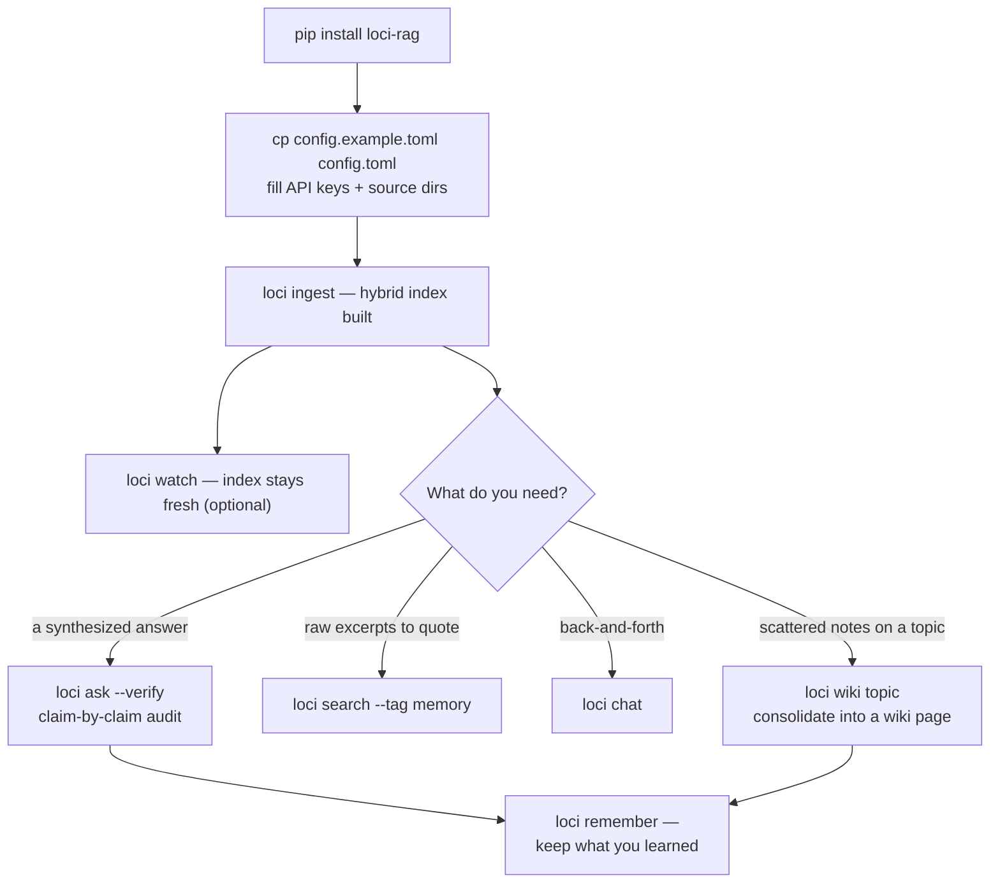

# loci 🧠

[](README.md)
[](README.zh-CN.md)
[](README.zh-TW.md)
[](README.ja.md)
[](README.ko.md)

> *이 번역은 영어 README(canonical)보다 늦을 수 있습니다.*

[](https://github.com/IvenKooLab/loci/actions/workflows/ci.yml)
[](https://github.com/IvenKooLab/loci/blob/main/LICENSE)
[](https://github.com/IvenKooLab/loci)
[](https://glama.ai/mcp/servers/IvenKooLab/loci)
[](https://modelscope.cn/mcp/servers/IvenKooLab/loci)

> 2000년 전, 연설가들은 연설문을 정신 속 궁전의 방마다 하나씩 두고 그 방들을 걸어 다니며 기억해냈습니다. **loci는 여러분의 파일에 똑같은 일을 해줍니다.**
>
> *Loci*는 모든 기억의 궁전(memory palace) 뒤에 있는 방법입니다. 지식을 장소에 두고, 경로를 따라 걸으며 회상합니다.

**열몇 개 디렉터리에 흩어진 프로젝트 문서, 노트, 채팅 로그를 위한, 질문 가능한 "제2의 뇌" — 그리고 MCP 서버까지内置되어 AI 에이전트도 바로 사용할 수 있습니다.**

로컬 파일 → 헤더 인식 청킹 → 임베딩 → 하이브리드 검색(벡터 + BM25) → 섹션 단위 출처 인용이 붙은 LLM 답변. 인덱스는 전부 여러분의 머신에 저장되고, 임베딩/채팅 호출만 외부로 나가며, 어떤 OpenAI 호환 API(智谱 / DeepSeek / Kimi / OpenAI / …)든 사용할 수 있습니다.

> **핵심 철학** (13개 고스타 도구에 대한 연구 기반 — 전문은 [경쟁 분석](docs/research/competitive-landscape.md) 참조): 채팅 앱을 하나 더 만들지 마세요. **모든 채팅 앱이 마운트할 수 있는 메모리 레이어**를 만드세요. Claude Desktop, Cursor, Cline 또는 어떤 MCP 호스트든 loci의 UI가 무료로 됩니다.

## 데모

[minimax-h3-turing](https://github.com/IvenKooLab/minimax-h3-turing) 문서를 인덱싱한 실제 세션 (표시용으로 경로 축약):

```
$ python main.py search "what the 22G card can and cannot do" -k 3

[1] minimax-h3-turing/docs/en/01-hardware-limits.md > 01 · What a 2080Ti 22G Can and Cannot Do    (similarity 0.562)
[2] minimax-h3-turing/docs/en/02-w4a8-vs-w4a4.md > 02 · Quantization Measured > You Can Try Without 22G  (similarity 0.446)
[3] minimax-h3-turing/docs/en/01-hardware-limits.md > ... > 3. VRAM is just barely enough — manage it  (similarity 0.504)

$ python main.py ask "How should I choose between T8 aggressive mode and the final-render mode, and why?"

Answer:
* Drafts / preview / shot selection: use T8 aggressive mode — a 43% speedup
  (2.7 min/clip), and "a different picture of equal quality" is fine for picking shots.
* Final shots: use final-render mode (no T8). T8 makes the numerical trajectory
  fork, so re-running with the same seed produces a different clip — which breaks
  the reproducibility final outputs need.

[source: docs/en/08-t8-blockcache-4step.md > Practical Advice (4-step Turbo route)]
[source: docs/en/06-faq.md > 12. Cache-style accelerators break "same-seed re-runs"]
```

하이브리드 검색 덕분에 중국어 쿼리도 영어 문서를 찾아냅니다(그 반대도 마찬가지). 키워드 증거(BM25)가 벡터 검색의 맹점을 메우고, 모든 인용은 파일이 아닌 **섹션**을 가리킵니다.

### 하이브리드 검색은 실제로 효과가 있을까? (이중 언어 10개 쿼리 미니 평가)

```
$ python scripts/eval_retrieval.py scripts/eval_cases.example.jsonl
vector-only: 9/10  →  hybrid: 10/10
```

## 리랭킹: 두 가지 프로바이더

`--rerank`는 융합된 후보를 재정렬합니다:

| 프로바이더 | 방식 | 비용 |
|---|---|---|
| `llm` (기본) | 채팅 모델로 후보별 0–3점 관련성 스코어링 | LLM 호출 1회 추가 |
| `local` | 크로스 인코더, `pip install 'loci-rag[rerank]'` 필요 | GPU에서 5쌍 약 30–70ms — 오프라인, 무료 |

## Obsidian / 노트 앱과의 관계

경쟁하지 않습니다 — 계층이 다를 뿐입니다. Obsidian(또는 어떤 에디터)이 노트 작성의 프런트엔드라면, loci는 **크로스 볼트 검색 엔진**입니다. `sources`를 임의의 디렉터리(Obsidian 볼트, 프로젝트 문서, 채팅 내보내기)로 향하게 하면 터미널·스크립트·MCP를 통한 AI 에이전트 어디서든 한 번에 검색할 수 있습니다. Obsidian 네이티브 요소도 이해합니다: frontmatter `tags:`(`--tag` 필터), `[[위키링크]]`(links 명령), 코드 블록은 절대 잘리지 않고, 한 줄짜리 노트도 검색됩니다.

## 설치 및 빠른 시작

Python 3.11+ 필요(표준 라이브러리 `tomllib` 사용).

```bash
# 방법 A: 패키지로 설치 (`loci`, `loci-mcp` 명령이 추가됨)
pip install -e ".[pdf,docx]"   # 선택 extras: 표 포함 PDF, Word 문서

# 방법 B: 설치 없는 퀵스타트
pip install -r requirements.txt

# 1. 설정: 예시를 복사하고 값 채우기
cp config.example.toml config.toml

# 2. 인제스트(증분 — 콘텐츠 해시 기반 중복 제거, 재실행 안전)
loci ingest            # 또는: python main.py ingest

# 3. 질문하기
loci ask "what did I write about X?"
```

### 워크플로



## 명령

| 명령 | 기능 |
|---|---|
| `ingest` | 소스 디렉터리 스캔, 신규/변경 파일 인덱스, 삭제된 파일 정리 (`--force` 전체 재구축) |
| `search "query"` | 검색만 — `경로 > 섹션` 빵크럼이 붙은 랭킹 발췌 |
| `ask "question"` | 검색 + 출처 인용이 붙은 LLM 답변 |
| `ask "…" --verify` | 답변에 주장 단위 감사 추가 (✓ 지지 / ~ 부분 / ✗ 미지지) |
| `links "note"` | 노트의 `[[위키링크]]` 출입 그래프 표시 |
| `chat` | 대화 기억이 있는 다중 턴 Q&A 루프 (`/clear`, `/exit`) |
| `wiki topic` | 인덱스의 해당 토픽 내용을 위키 페이지 하나로 증류 |
| `remember text` | 영구 메모 노트를 쓰고 즉시 인덱스 |
| `stats` | 인덱스 현황: 소스별 청크 수, 모델, 검색 설정 |
| `doctor` | 헬스 체크: 설정, 소스 디렉터리, embed/LLM 엔드포인트, 스토어 |
| `watch` | 소스 폴링으로 인덱스 최신 유지 (선택) |
| `python mcp_server.py` | MCP 서버 (stdio, 아래 참조) |

필터 연산자 (`search`와 `ask`에서 자유 조합):

| 플래그 | 필터 대상 |
|---|---|
| `--tag foo` | frontmatter 태그에 `foo`를 포함하는 파일 |
| `--in docs/en` | 경로에 해당 부분 문자열을 포함하는 파일 |
| `--since 2026-08` / `--since 2026-08-15` | 해당 날짜 이후 수정된 파일 |
| `-e "exact phrase"` | 정확한 구문을 포함하는 청크 |
| `-k N` | 히트 수 (기본 5) |

## 하나의 메모리, 모든 IDE

모든 MCP 호스트가 마운트하는 것은 **같은** loci 서버(같은 `config.toml`, 같은 인덱스)입니다. 한 도구에서 쓴 메모리를 다른 모든 도구에서 불러올 수 있습니다:

```bash
# Claude Code
claude mcp add loci -- loci-mcp
```

```jsonc
// Cursor / Cline / Qoder / Trae (mcpServers JSON — 어디서나 같은 형태)
{ "mcpServers": { "loci": { "command": "loci-mcp" } } }
```

그 후 어디서든: *"staging 비밀번호는 월요일마다 교체한다고 기억해"* → `brain_remember` → 나중에 **다른** IDE에서: *"staging 비밀번호는 언제 교체?"* → 인용이 붙은 답변. 메모리는 `memories` 디렉터리의 평문 markdown으로 저장(git 친화적, 락인 없음)되며 `memory` 태그가 붙어 `loci search --tag memory`로 메모리만 검색할 수 있습니다.

> **크로스 IDE 팁**: 기본 `store` / `memories` 경로는 loci 실행 디렉터리 기준 상대 경로입니다. IDE마다 다른 프로젝트 폴더에서 실행한다면 `config.toml`에서 둘 다 하나의 절대 위치로 향하게 하세요 — 예: `store.path = "~/.loci/store"`, `memories.path = "~/.loci/memories"` — 그러면 모든 IDE가 정확히 같은 메모리 스토어를 공유합니다.

## 어떤 MCP 호스트에든 마운트

`claude_desktop_config.json`(Claude Desktop) 또는 MCP 클라이언트 설정에 추가:

```json
{
  "mcpServers": {
    "loci": {
      "command": "python",
      "args": ["/path/to/second-brain-rag/mcp_server.py"]
    }
  }
}
```

도구 외에 서버는 완전한 프로토콜을 지원합니다:

- **Resources** — `resources/list`가 `brain://stats`와 인덱스된 파일마다 `brain://note/…` 리소스를 노출(`resources/read`로 원본 markdown 획득)
- **Prompts** — 세 가지 템플릿: `brain-briefing`, `study-plan`, `contradiction-check`

## 도구 목록

| 도구 | 기능 |
|---|---|
| `brain_search(query, k?, tag?, in?)` | 빵크럼이 붙은 랭킹 발췌 |
| `brain_ask(question, verify?)` | 검색 결과에 근거한 인용 답변; `verify=true`는 주장 단위 감사 추가 |
| `brain_wiki(topic)` | **메모리 통합** — 인덱스의 내용을 상호 링크된 위키 페이지로 증류 |
| `brain_remember(text, title?, tags?)` | **영구 메모리 쓰기** — 세션과 IDE를 넘어 공유 |
| `brain_forget(query)` | 노트 주변의 `[[위키링크]]` 그래프 |
| `brain_stats()` | 인덱스 개요(소스별 청크 수) |
| `brain_ingest(force?)` | 증분 재인덱스 |

## 완전 오프라인: Ollama

인덱스는 설계상 로컬 — 임베딩/채팅 호출도 그렇게 할 수 있습니다. 어떤 OpenAI 호환 서버든 동작하며, [Ollama](https://ollama.com)는 엔드투엔드로 검증되었습니다:

```toml
[llm]
base_url = "http://localhost:11434/v1"
api_key = "ollama"          # 비어있지 않은 임의의 플레이스홀더
model = "qwen2.5:0.5b"

[embed]
base_url = "http://localhost:11434/v1"
api_key = "ollama"
model = "all-minilm"
```

이 설정으로 `ingest` / `search` / `ask`는 클라우드 호출이 전혀 없습니다. 더 큰 로컬 채팅 모델로 바꾸면 답변 품질도 향상됩니다 — 파이프라인은 모델 비종속입니다.

## 설정

| 키 | 의미 |
|---|---|
| `[llm]` | base_url / api_key / model — 어떤 OpenAI 호환 엔드포인트든 |
| `[embed]` | 동일; model은 embedding 모델이어야 함 (예: `embedding-3`) |
| `[[sources]]` | 문서 디렉터리 목록, `.md` / `.txt`를 재귀 스캔 (extras 설치 시 `.pdf` / `.docx`도) |
| `[[sources]] chunk_size` / `chunk_overlap` | 디렉터리별 청킹 설정 오버라이드 |
| `[chunk]` | 전역 청킹 파라미터 (기본 800자 / 100 겹침) |
| `[top_k]` | 검색당 히트 수 (기본 5) |
| `[retrieval]` | `hybrid`(벡터+BM25 융합, 기본 ON), `rrf_k`, `rerank`(LLM 재정렬, 기본 OFF) |
| `[memories]` / `[wiki]` | 메모리 노트와 wiki 페이지 디렉터리(자동으로 인덱스에 합류) |
| `[watch]` | 폴링 간격 초 |

API 키는 환경 변수 `BRAIN_LLM_API_KEY` / `BRAIN_EMBED_API_KEY`로도 제공 가능(설정 파일보다 우선).

## 설계 결정

- **핵심 약 500줄, LangChain 없음** — 모든 단계를 읽고, 고치고, 배울 수 있습니다. 엔진 전체가 한 번에 읽힙니다
- **MCP 우선** — AI 호스트 생태계가 곧 UI 레이어. Web 앱 유지보수 불필요
- **하이브리드 검색 기본 ON** — 벡터 검색과 네이티브 BM25(CJK 대응 토크나이저)를 RRF로 융합
- **인용에는 항상 빵크럼** — `경로 > 섹션` 형태로 주장을 즉시 검증 가능
- **견고하고 투명한 인덱싱** — 방어적 로더(파싱 불가는 건너뛰고 멈추지 않음), 콘텐츠 해시 증분, 실제 정리, `stats` / `doctor` 명령으로 인덱스는 결코 블랙박스가 되지 않습니다
- **짧은 노트도 검색 가능** — 최소 청크 필터 없음. 한 줄 노트도 인덱스됩니다
- **키는 코드에 두지 않음** — `config.toml`(gitignore됨) 또는 환경 변수

## 포지셔닝 비교

| | loci | AnythingLLM (65k★) | Khoj (37k★) | RAGFlow (90k★) |
|---|---|---|---|---|
| 포지셔닝 | 개인 검색 **백엔드** + MCP | 올인원 채팅 플랫폼 | 셀프호스팅 AI 어시스턴트 | 엔터프라이즈 RAG 엔진 |
| 풋프린트 | 런타임 의존 2개, Docker 없음 | 데스크톱/Docker | Django 서버 + 워커 | Docker, DeepDoc 모델 |
| UI | 여러분의 터미널과 에이전트 | 내장 웹/데스크톱 | 웹 + Obsidian/Emacs | 웹 |
| MCP 서버 | ✅ 네이티브 | 컨슈머 | — | — |
| 핵심 가독성 | ✅ 약 500줄 | ✗ | ✗ | ✗ |
| 다중 사용자 | 설계상 없음 | ✅ | ✅ | ✅ |

(전체 데이터와 논거는 [경쟁 분석](docs/research/competitive-landscape.md) 참조.)

## 로드맵

[docs/roadmap.md](docs/roadmap.md) 참조 — 리랭킹, GraphRAG 실험, 추가 로더.

## 라이선스

MIT
