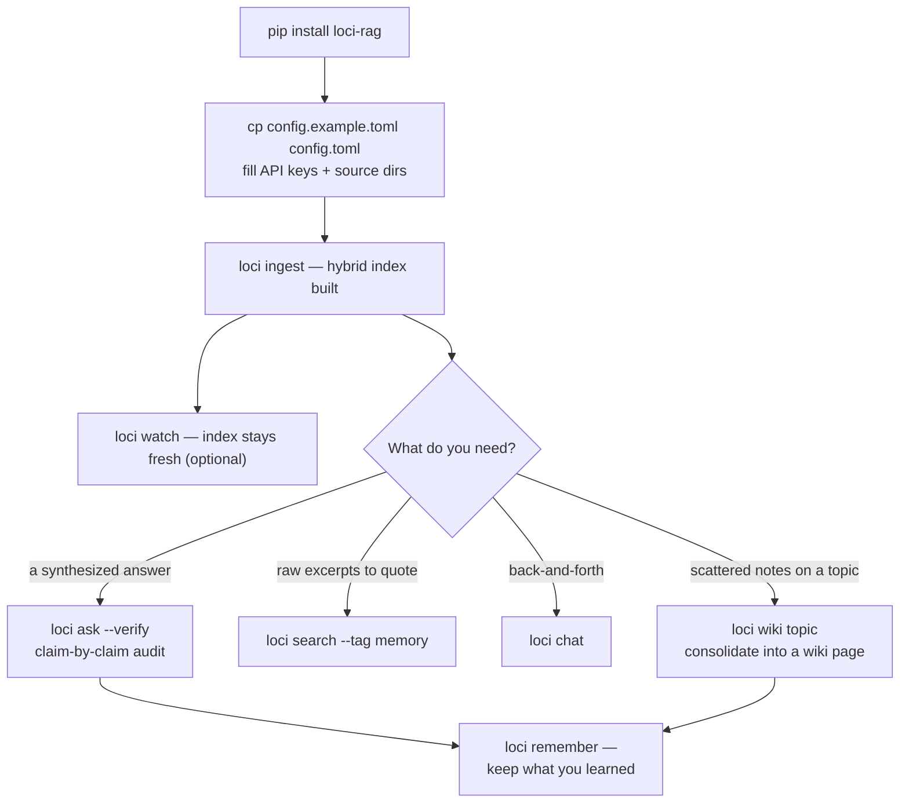

# loci 🧠

[](README.md)
[](README.zh-CN.md)
[](README.zh-TW.md)
[](README.ja.md)
[](README.ko.md)

> *本翻译可能滞后于英文主文档（canonical）。*

[](https://github.com/IvenKooLab/loci/actions/workflows/ci.yml)
[](https://github.com/IvenKooLab/loci/blob/main/LICENSE)
[](https://github.com/IvenKooLab/loci)
[](https://glama.ai/mcp/servers/IvenKooLab/loci)
[](https://modelscope.cn/mcp/servers/IvenKooLab/loci)

> 两千年前的演说家把讲稿放进脑中宫殿的房间，走一遍就能想起来。**loci 为你的文件做同样的事。**
>
> *Loci* 是所有记忆宫殿背后的方法：把知识放进位置，沿路径回忆。

**给散落在十几个目录里的项目文档、笔记、聊天记录，装一个可问答的「第二大脑」——外加一个 MCP server，让你的 AI 客户端也能直接使用。**

本地文件 → 标题感知切分 → 向量化 → 混合检索（向量 + BM25）→ 带章节引用的 LLM 回答。索引完全保存在你的机器上；只有向量化/对话调用会出去，走任意 OpenAI 兼容 API（智谱 / DeepSeek / Kimi / OpenAI / …）。

> **核心论点**（来自对 13 个高星工具的研究——详见[竞品分析](docs/research/competitive-landscape.md)）：不要再造一个聊天 App。做**所有聊天应用都能挂载的记忆层**。Claude Desktop、Cursor、Cline 或任何 MCP 宿主，都能免费成为 loci 的界面。

## Demo

真实会话，索引自 [minimax-h3-turing](https://github.com/IvenKooLab/minimax-h3-turing) 的文档（路径已缩短显示）：

```
$ python main.py search "what the 22G card can and cannot do" -k 3

[1] minimax-h3-turing/docs/en/01-hardware-limits.md > 01 · What a 2080Ti 22G Can and Cannot Do    (similarity 0.562)
[2] minimax-h3-turing/docs/en/02-w4a8-vs-w4a4.md > 02 · Quantization Measured > You Can Try Without 22G  (similarity 0.446)
[3] minimax-h3-turing/docs/en/01-hardware-limits.md > ... > 3. VRAM is just barely enough — manage it  (similarity 0.504)

$ python main.py ask "How should I choose between T8 aggressive mode and the final-render mode, and why?"

Answer:
* Drafts / preview / shot selection: use T8 aggressive mode — a 43% speedup
  (2.7 min/clip), and "a different picture of equal quality" is fine for picking shots.
* Final shots: use final-render mode (no T8). T8 makes the numerical trajectory
  fork, so re-running with the same seed produces a different clip — which breaks
  the reproducibility final outputs need.

[source: docs/en/08-t8-blockcache-4step.md > Practical Advice (4-step Turbo route)]
[source: docs/en/06-faq.md > 12. Cache-style accelerators break "same-seed re-runs"]
```

混合检索意味着中文查询也能命中英文文档（反之亦然）——关键词证据（BM25）补上向量检索的盲区，而且每条引用都指向**章节**，不只是文件。

### 混合检索真的有用吗？（10 条双语查询实测）

```
$ python scripts/eval_retrieval.py scripts/eval_cases.example.jsonl
vector-only: 9/10  →  hybrid: 10/10
```

混合检索还修正了关键词型查询的第 1 名（例如 "T8 block cache threshold speedup"：纯向量把一篇 FAQ 排第一，混合检索把真正的 T8 实测文档排第一）。用你自己的语料和查询文件跑一遍即可验证。

### 重排序：两种 Provider

`--rerank` 会对融合后的候选做精排：

| Provider | 方式 | 代价 |
|---|---|---|
| `llm`（默认） | 由你的对话模型做 0–3 分逐条评分 | 一次额外 LLM 调用 |
| `local` | 交叉编码器，需 `pip install 'loci-rag[rerank]'` | GPU 上 5 对约 30–70 毫秒——离线、免费 |

## 它与 Obsidian / 笔记应用的关系

不冲突——两者分层协作。Obsidian（或任意编辑器）是笔记前端；loci 是**跨库检索引擎**：把 `sources` 指向任意目录（Obsidian 库、项目文档、聊天导出），一次查询覆盖全部——从终端、脚本或经 MCP 的 AI 代理。Obsidian 原生细节都能理解：frontmatter `tags:`（`--tag` 过滤）、`[[双链]]`（`links` 命令）、代码块永不切断、单行笔记也能搜到。

## 安装与快速开始

需要 Python 3.11+（使用标准库 `tomllib`）。

```bash
# 方式 A：装成包（附带 `loci` 和 `loci-mcp` 两个命令）
pip install -e ".[pdf,docx]"   # 可选 extras：PDF 含表格、Word 文档

# 方式 B：免安装快速开始
pip install -r requirements.txt

# 1. 配置：复制示例并填入你的值
cp config.example.toml config.toml

# 2. 灌库（增量——按内容 hash 去重，可安全重跑）
loci ingest            # 或: python main.py ingest

# 3. 提问
loci ask "what did I write about X?"
```

### 工作流



## 命令

| 命令 | 作用 |
|---|---|
| `ingest` | 扫描来源目录，索引新增/变更文件，清理已删除文件（`--force` 全量重建） |
| `search "query"` | 纯检索——带 `路径 > 章节` 面包屑的排序结果 |
| `ask "question"` | 检索 + LLM 回答，带 `[source: path > section]` 引用 |
| `ask "…" --verify` | 追加逐条主张审计（✓ 支持 / ~ 部分 / ✗ 不支持） |
| `links "note"` | 显示某笔记的 `[[双链]]` 出入图谱 |
| `chat` | 多轮问答循环（`/clear`、`/exit`） |
| `wiki topic` | 把索引中关于某主题的内容蒸馏成一页 wiki |
| `remember text` | 写入持久记忆笔记并立即索引 |
| `stats` | 索引概况：每个来源的 chunk 数、模型、检索设置 |
| `doctor` | 健康检查：配置、来源目录、embed/LLM 端点、存储 |
| `watch` | 轮询来源保持索引最新（可选） |
| `python mcp_server.py` | MCP server（stdio，见下文） |

过滤操作符（`search` 和 `ask` 均可自由组合）：

| 参数 | 过滤范围 |
|---|---|
| `--tag foo` | frontmatter 标签含 `foo` 的文件 |
| `--in docs/en` | 路径含该子串的文件 |
| `--since 2026-08` / `--since 2026-08-15` | 该日期之后修改的文件 |
| `-e "exact phrase"` | 含精确短语的 chunk |
| `-k N` | 返回 N 条（默认 5） |

## 一份记忆，所有 IDE

每个 MCP 宿主挂载的都是**同一个** loci server（同一 `config.toml`、同一索引），因此一个工具写入的记忆，其他所有工具都能召回：

```bash
# Claude Code
claude mcp add loci -- loci-mcp
```

```jsonc
// Cursor / Cline / Qoder / Trae（mcpServers JSON——各平台形状一致）
{ "mcpServers": { "loci": { "command": "loci-mcp" } } }
```

然后，在任意一个里：*"记住 staging 密码每周一轮换"* → `brain_remember` → 稍后在**另一个** IDE 里：*"staging 密码什么时候轮换？"* → 得到带引用的回答。记忆以纯 markdown 存放在 `memories` 目录（git 友好、无锁定），统一打 `memory` 标签，`loci search --tag memory` 可专搜记忆。

> **跨 IDE 提示**：默认的 `store` / `memories` 路径相对于 loci 的启动目录。如果你的 IDE 从不同项目目录启动，请在 `config.toml` 里把两者指向同一个绝对位置——例如 `store.path = "~/.loci/store"`、`memories.path = "~/.loci/memories"`——所有 IDE 即共享同一份记忆库。

## 接入任意 MCP 宿主

加入 `claude_desktop_config.json`（Claude Desktop）或你的 MCP 客户端配置：

```json
{
  "mcpServers": {
    "loci": {
      "command": "python",
      "args": ["/path/to/second-brain-rag/mcp_server.py"]
    }
  }
}
```

除工具外，server 还支持完整协议：

- **Resources** —— `resources/list` 暴露 `brain://stats` 和每个已索引文件的 `brain://note/…` 资源（经 `resources/read` 读取原始 markdown）
- **Prompts** —— 三个预置模板：`brain-briefing`、`study-plan`、`contradiction-check`

## 工具一览

| 工具 | 用途 |
|---|---|
| `brain_search(query, k?, tag?, in?)` | 带面包屑的排序摘录 |
| `brain_ask(question, verify?)` | 基于索引的引用式回答；`verify=true` 追加逐条审计 |
| `brain_wiki(topic)` | **记忆巩固**——把索引蒸馏成互链 wiki 页 |
| `brain_remember(text, title?, tags?)` | **写入持久记忆**——跨会话、跨 IDE 共享 |
| `brain_forget(query)` | 软删除匹配记忆（进 `.trash` 文件夹） |
| `brain_links(note)` | 笔记的出入 `[[wikilink]]` 图谱 |
| `brain_stats()` | 索引概况（每个来源的 chunk 数） |
| `brain_ingest(force?)` | 增量重建索引 |

## 全离线：Ollama

索引天然本地——向量和对话调用也可以。任何 OpenAI 兼容服务都行，[Ollama](https://ollama.com) 已端到端验证：

```toml
[llm]
base_url = "http://localhost:11434/v1"
api_key = "ollama"          # 任意非空占位符
model = "qwen2.5:0.5b"

[embed]
base_url = "http://localhost:11434/v1"
api_key = "ollama"
model = "all-minilm"
```

此配置下 `ingest` / `search` / `ask` 零云端调用。换更大的本地对话模型即可获得更好的回答——管线与模型无关。

## 配置

| 键 | 含义 |
|---|---|
| `[llm]` | base_url / api_key / model——任意 OpenAI 兼容端点 |
| `[embed]` | 同上；model 须为 embedding 模型（如 `embedding-3`） |
| `[[sources]]` | 文档目录列表，递归扫描 `.md` / `.txt`（装了 extras 还支持 `.pdf` / `.docx`） |
| `[[sources]] chunk_size` / `chunk_overlap` | 按目录覆盖切分参数 |
| `[chunk]` | 全局切分参数（默认 800 字符 / 100 重叠） |
| `[top_k]` | 每次搜索的命中数（默认 5） |
| `[retrieval]` | `hybrid`（向量+BM25 融合，默认开）、`rrf_k`、`rerank`（LLM 重排，默认关） |
| `[memories]` / `[wiki]` | 记忆笔记与 wiki 页的目录（自动并入索引） |
| `[watch]` | 轮询间隔秒数 |

API key 也可用环境变量 `BRAIN_LLM_API_KEY` / `BRAIN_EMBED_API_KEY`（覆盖配置文件）。

## 设计决策

- **核心约 500 行，不用 LangChain**——每个环节都可读、可改、可学，整个引擎一次能读完
- **MCP 优先**——AI 宿主生态就是 UI 层，无需自己维护 Web 应用
- **混合检索默认开启**——向量 + 原生 BM25（CJK 友好分词）经 RRF 融合
- **引用必带，且带面包屑**——`路径 > 章节`，结论随时可查证
- **索引健壮、可检视**——防御性加载器（解析失败的跳过且不卡死）、内容 hash 增量、真实清理、`stats` / `doctor` 命令让索引永不黑箱
- **小笔记也能搜到**——不做最小 chunk 过滤，一行笔记同样入库
- **密钥不入代码**——`config.toml`（已 gitignore）或环境变量

## 定位对比

| | loci | AnythingLLM (65k★) | Khoj (37k★) | RAGFlow (90k★) |
|---|---|---|---|---|
| 定位 | 个人检索**后端** + MCP | 全能聊天平台 | 自托管 AI 助手 | 企业级 RAG 引擎 |
| 体量 | 2 个运行时依赖，无 Docker | 桌面/Docker | Django 服务 + worker | Docker + DeepDoc 模型 |
| 界面 | 你的终端与你的代理 | 内置 Web/桌面 | Web + Obsidian/Emacs | Web |
| MCP server | ✅ 原生 | 消费端 | — | — |
| 核心可读性 | ✅ 约 300 行 | ✗ | ✗ | ✗ |
| 多用户 | 设计上不做 | ✅ | ✅ | ✅ |

（完整数据与推理见[竞品分析](docs/research/competitive-landscape.md)。）

## 路线图

见 [docs/roadmap.md](docs/roadmap.md)——重排序、GraphRAG 实验、更多加载器。

## 许可证

MIT
