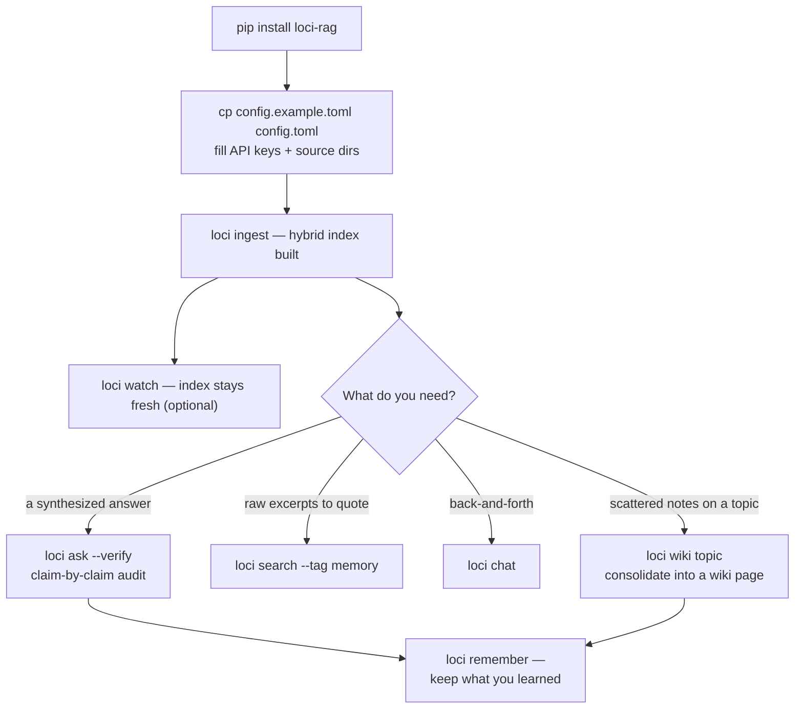

# loci 🧠

[](README.md)
[](README.zh-CN.md)
[](README.zh-TW.md)
[](README.ja.md)
[](README.ko.md)

> *本翻譯可能落後於英文主文件（canonical）。*

[](https://github.com/IvenKooLab/loci/actions/workflows/ci.yml)
[](https://github.com/IvenKooLab/loci/blob/main/LICENSE)
[](https://github.com/IvenKooLab/loci)
[](https://glama.ai/mcp/servers/IvenKooLab/loci)
[](https://modelscope.cn/mcp/servers/IvenKooLab/loci)

> 兩千年前的演說家把講稿放進腦中宮殿的房間，走一遍就能想起來。**loci 為你的檔案做同樣的事。**
>
> *Loci* 是所有記憶宮殿背後的方法：把知識放進位置，沿路徑回憶。

**給散落在十幾個目錄裡的專案文件、筆記、聊天記錄，裝一個可問答的「第二大腦」——外加一個 MCP server，讓你的 AI 客戶端也能直接使用。**

本地檔案 → 標題感知切分 → 向量化 → 混合檢索（向量 + BM25）→ 帶章節引用的 LLM 回答。索引完全保存在你的機器上；只有向量化/對話調用會出去，走任意 OpenAI 相容 API（智譜 / DeepSeek / Kimi / OpenAI / …）。

> **核心論點**（來自對 13 個高星工具的研究——詳見[競品分析](docs/research/competitive-landscape.md)）：不要再造一個聊天 App。做**所有聊天應用都能掛載的記憶層**。Claude Desktop、Cursor、Cline 或任何 MCP 宿主，都能免費成為 loci 的介面。

## Demo

真實會話，索引自 [minimax-h3-turing](https://github.com/IvenKooLab/minimax-h3-turing) 的文件（路徑已縮短顯示）：

```
$ python main.py search "what the 22G card can and cannot do" -k 3

[1] minimax-h3-turing/docs/en/01-hardware-limits.md > 01 · What a 2080Ti 22G Can and Cannot Do    (similarity 0.562)
[2] minimax-h3-turing/docs/en/02-w4a8-vs-w4a4.md > 02 · Quantization Measured > You Can Try Without 22G  (similarity 0.446)
[3] minimax-h3-turing/docs/en/01-hardware-limits.md > ... > 3. VRAM is just barely enough — manage it  (similarity 0.504)

$ python main.py ask "How should I choose between T8 aggressive mode and the final-render mode, and why?"

Answer:
* Drafts / preview / shot selection: use T8 aggressive mode — a 43% speedup
  (2.7 min/clip), and "a different picture of equal quality" is fine for picking shots.
* Final shots: use final-render mode (no T8). T8 makes the numerical trajectory
  fork, so re-running with the same seed produces a different clip — which breaks
  the reproducibility final outputs need.

[source: docs/en/08-t8-blockcache-4step.md > Practical Advice (4-step Turbo route)]
[source: docs/en/06-faq.md > 12. Cache-style accelerators break "same-seed re-runs"]
```

混合檢索意味著中文查詢也能命中英文文件（反之亦然）——關鍵詞證據（BM25）補上向量檢索的盲區，而且每條引用都指向**章節**，不只是檔案。

### 混合檢索真的有用嗎？（10 條雙語查詢實測）

```
$ python scripts/eval_retrieval.py scripts/eval_cases.example.jsonl
vector-only: 9/10  →  hybrid: 10/10
```

## 記憶路線：兩種 Provider

`--rerank` 會對融合後的候選做精排：

| Provider | 方式 | 代價 |
|---|---|---|
| `llm`（預設） | 由你的對話模型做 0–3 分逐條評分 | 一次額外 LLM 調用 |
| `local` | 交叉編碼器，需 `pip install 'loci-rag[rerank]'` | GPU 上 5 對約 30–70 毫秒——離線、免費 |

## 它與 Obsidian / 筆記應用的關係

不衝突——兩者分層協作。Obsidian（或任意編輯器）是筆記前端；loci 是**跨庫檢索引擎**：把 `sources` 指向任意目錄（Obsidian 庫、專案文件、聊天導出），一次查詢覆蓋全部——從終端、腳本或經 MCP 的 AI 代理。Obsidian 原生細節都能理解：frontmatter `tags:`（`--tag` 過濾）、`[[雙鏈]]`（`links` 命令）、程式碼塊永不切斷、單行筆記也能搜到。

## 安裝與快速開始

需要 Python 3.11+（使用標準庫 `tomllib`）。

```bash
# 方式 A：裝成套件（附帶 `loci` 和 `loci-mcp` 兩個命令）
pip install -e ".[pdf,docx]"   # 可選 extras：PDF 含表格、Word 文件

# 方式 B：免安裝快速開始
pip install -r requirements.txt

# 1. 設定：複製範例並填入你的值
cp config.example.toml config.toml

# 2. 灌庫（增量——按內容 hash 去重，可安全重跑）
loci ingest            # 或: python main.py ingest

# 3. 提問
loci ask "what did I write about X?"
```

### 工作流



## 命令

| 命令 | 作用 |
|---|---|
| `ingest` | 掃描來源目錄，索引新增/變更檔案，清理已刪除檔案（`--force` 全量重建） |
| `search "query"` | 純檢索——帶 `路徑 > 章節` 麵包屑的排序結果 |
| `ask "question"` | 檢索 + LLM 回答，帶 `[source: path > section]` 引用 |
| `ask "…" --verify` | 追加逐條主張審計（✓ 支援 / ~ 部分 / ✗ 不支援） |
| `links "note"` | 顯示某筆記的 `[[雙鏈]]` 出入圖譜 |
| `chat` | 多輪問答循環（`/clear`、`/exit`） |
| `wiki topic` | 把索引中關於某主題的內容蒸餾成一頁 wiki |
| `remember text` | 寫入持久記憶筆記並立即索引 |
| `stats` | 索引概況：每個來源的 chunk 數、模型、檢索設定 |
| `doctor` | 健康檢查：設定、來源目錄、embed/LLM 端點、儲存 |
| `watch` | 輪詢來源保持索引最新（可選） |
| `python mcp_server.py` | MCP server（stdio，見下文） |

過濾運算元（`search` 和 `ask` 均可自由組合）：

| 參數 | 過濾範圍 |
|---|---|
| `--tag foo` | frontmatter 標籤含 `foo` 的檔案 |
| `--in docs/en` | 路徑含該子字串的檔案 |
| `--since 2026-08` / `--since 2026-08-15` | 該日期之後修改的檔案 |
| `-e "exact phrase"` | 含精確短語的 chunk |
| `-k N` | 返回 N 條（預設 5） |

## 一份記憶，所有 IDE

每個 MCP 宿主掛載的都是**同一個** loci server（同一 `config.toml`、同一索引），因此一個工具寫入的記憶，其他所有工具都能召回：

```bash
# Claude Code
claude mcp add loci -- loci-mcp
```

```jsonc
// Cursor / Cline / Qoder / Trae（mcpServers JSON——各平台形狀一致）
{ "mcpServers": { "loci": { "command": "loci-mcp" } } }
```

然後，在任意一個裡：*「記住 staging 密碼每週一輪換」* → `brain_remember` → 稍後在**另一個** IDE 裡：*「staging 密碼什麼時候輪換？」* → 得到帶引用的回答。記憶以純 markdown 存放在 `memories` 目錄（git 友好、無鎖定），統一打 `memory` 標籤，`loci search --tag memory` 可專搜記憶。

> **跨 IDE 提示**：預設的 `store` / `memories` 路徑相對於 loci 的啟動目錄。如果你的 IDE 從不同專案目錄啟動，請在 `config.toml` 裡把兩者指向同一個絕對位置——例如 `store.path = "~/.loci/store"`、`memories.path = "~/.loci/memories"`——所有 IDE 即共享同一份記憶庫。

## 接入任意 MCP 宿主

加入 `claude_desktop_config.json`（Claude Desktop）或你的 MCP 客戶端配置：

```json
{
  "mcpServers": {
    "loci": {
      "command": "python",
      "args": ["/path/to/second-brain-rag/mcp_server.py"]
    }
  }
}
```

除工具外，server 還支援完整協議：

- **Resources** —— `resources/list` 暴露 `brain://stats` 和每個已索引檔案的 `brain://note/…` 資源（經 `resources/read` 讀取原始 markdown）
- **Prompts** —— 三個預置模板：`brain-briefing`、`study-plan`、`contradiction-check`

## 工具一覽

| 工具 | 用途 |
|---|---|
| `brain_search(query, k?, tag?, in?)` | 帶麵包屑的排序摘錄 |
| `brain_ask(question, verify?)` | 基於索引的引用式回答；`verify=true` 追加逐條審計 |
| `brain_wiki(topic)` | **記憶鞏固**——把索引蒸餾成互鏈 wiki 頁 |
| `brain_remember(text, title?, tags?)` | **寫入持久記憶**——跨會話、跨 IDE 共享 |
| `brain_forget(query)` | 軟刪除匹配記憶（進 `.trash` 資料夾） |
| `brain_links(note)` | 筆記的出入 `[[wikilink]]` 圖譜 |
| `brain_stats()` | 索引概況（每個來源的 chunk 數） |
| `brain_ingest(force?)` | 增量重建索引 |

## 全離線：Ollama

索引天然本地——向量和對話調用也可以。任何 OpenAI 相容服務都行，[Ollama](https://ollama.com) 已端到端驗證：

```toml
[llm]
base_url = "http://localhost:11434/v1"
api_key = "ollama"          # 任意非空佔位符
model = "qwen2.5:0.5b"

[embed]
base_url = "http://localhost:11434/v1"
api_key = "ollama"
model = "all-minilm"
```

此配置下 `ingest` / `search` / `ask` 雲端調用為零。換更大的本地對話模型即可獲得更好的回答——管線與模型無關。

## 設定

| 鍵 | 含義 |
|---|---|
| `[llm]` | base_url / api_key / model——任意 OpenAI 相容端點 |
| `[embed]` | 同上；model 須為 embedding 模型（如 `embedding-3`） |
| `[[sources]]` | 文件目錄列表，遞迴掃描 `.md` / `.txt`（裝了 extras 還支援 `.pdf` / `.docx`） |
| `[[sources]] chunk_size` / `chunk_overlap` | 按目錄覆蓋切分參數 |
| `[chunk]` | 全域切分參數（預設 800 字元 / 100 重疊） |
| `[top_k]` | 每次搜尋的命中數（預設 5） |
| `[retrieval]` | `hybrid`（向量+BM25 融合，預設開）、`rrf_k`、`rerank`（LLM 重排，預設關） |
| `[memories]` / `[wiki]` | 記憶筆記與 wiki 頁的目錄（自動併入索引） |
| `[watch]` | 輪詢間隔秒數 |

API key 也可用環境變數 `BRAIN_LLM_API_KEY` / `BRAIN_EMBED_API_KEY`（覆蓋設定檔）。

## 設計決策

- **核心約 500 行，不用 LangChain**——每個環節都可讀、可改、可學，整個引擎一次能讀完
- **MCP 優先**——AI 宿主生態就是 UI 層，無需自己維護 Web 應用
- **混合檢索預設開啟**——向量 + 原生 BM25（CJK 友好分詞）經 RRF 融合
- **引用必帶，且帶麵包屑**——`路徑 > 章節`，結論隨時可查證
- **索引健壯、可檢視**——防禦性載入器（解析失敗的跳過且不卡死）、內容 hash 增量、真實清理、`stats` / `doctor` 命令讓索引永不黑箱
- **小筆記也能搜到**——不做最小 chunk 過濾，一行筆記同樣入庫
- **金鑰不入程式碼**——`config.toml`（已 gitignore）或環境變數

## 定位對比

| | loci | AnythingLLM (65k★) | Khoj (37k★) | RAGFlow (90k★) |
|---|---|---|---|---|
| 定位 | 個人檢索**後端** + MCP | 全能聊天平台 | 自託管 AI 助手 | 企業級 RAG 引擎 |
| 體量 | 2 個執行時依賴，無 Docker | 桌面/Docker | Django 服務 + worker | Docker + DeepDoc 模型 |
| 介面 | 你的終端與你的代理 | 內建 Web/桌面 | Web + Obsidian/Emacs | Web |
| MCP server | ✅ 原生 | 消費端 | — | — |
| 核心可讀性 | ✅ 約 500 行 | ✗ | ✗ | ✗ |
| 多用戶 | 設計上不做 | ✅ | ✅ | ✅ |

（完整數據與推理見[競品分析](docs/research/competitive-landscape.md)。）

## 路線圖

見 [docs/roadmap.md](docs/roadmap.md)——重排序、GraphRAG 實驗、更多載入器。

## 授權條款

MIT
