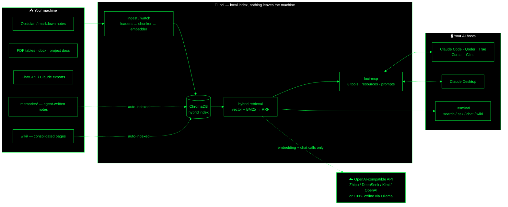
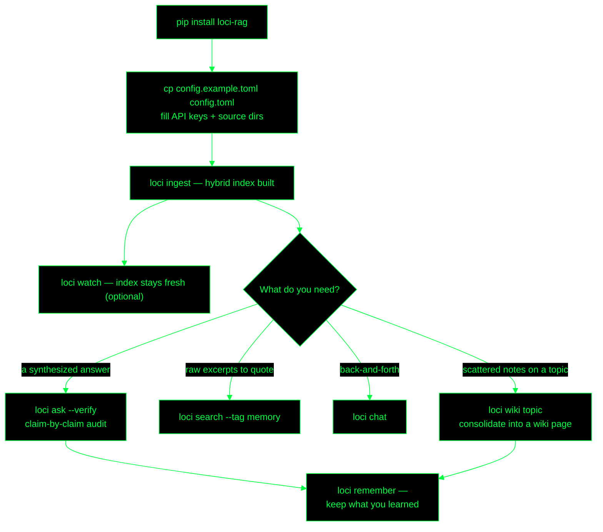
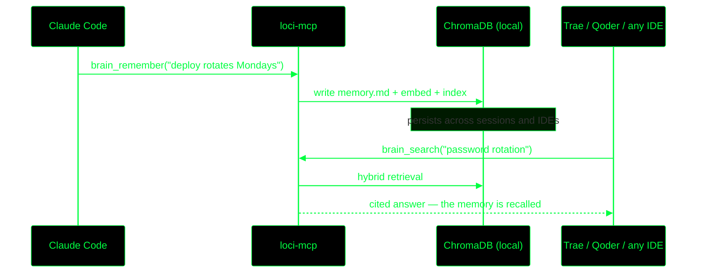

# Diagram sources

Editable Mermaid sources for the README diagrams. GitHub renders the
README's mermaid blocks natively; the two hero diagrams are also shipped
as pre-styled dark SVGs in docs/assets/.

## system-interactions

## workflow

## cross-ide-memory-sequence

